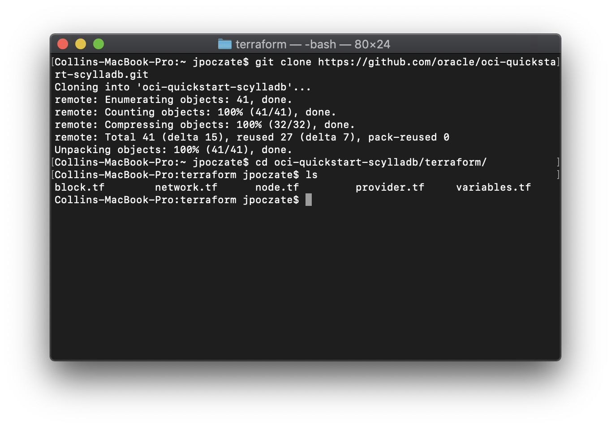
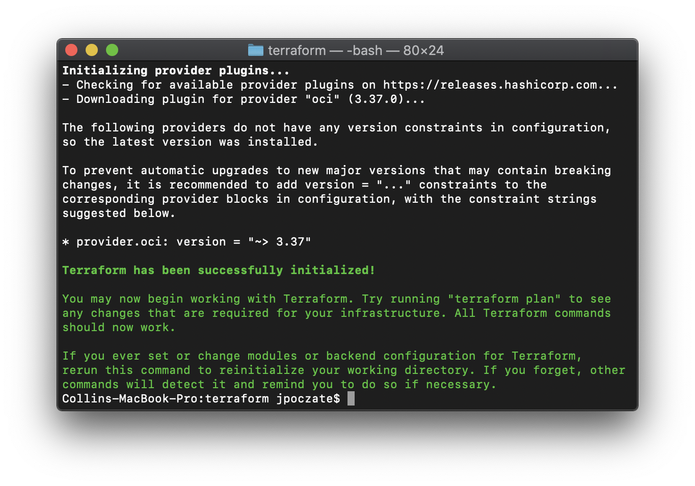
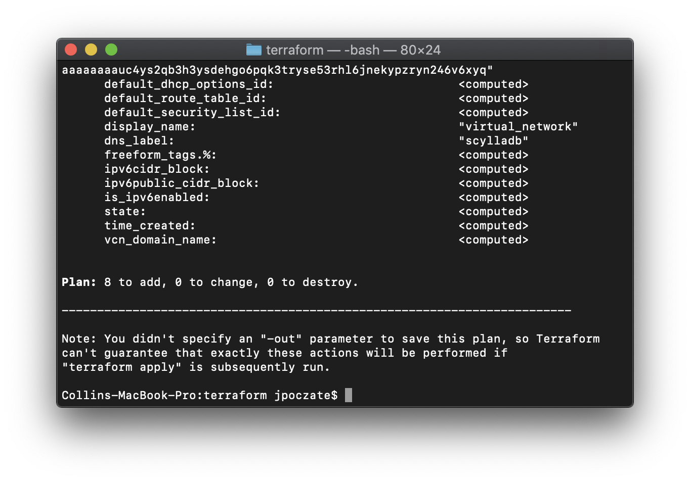
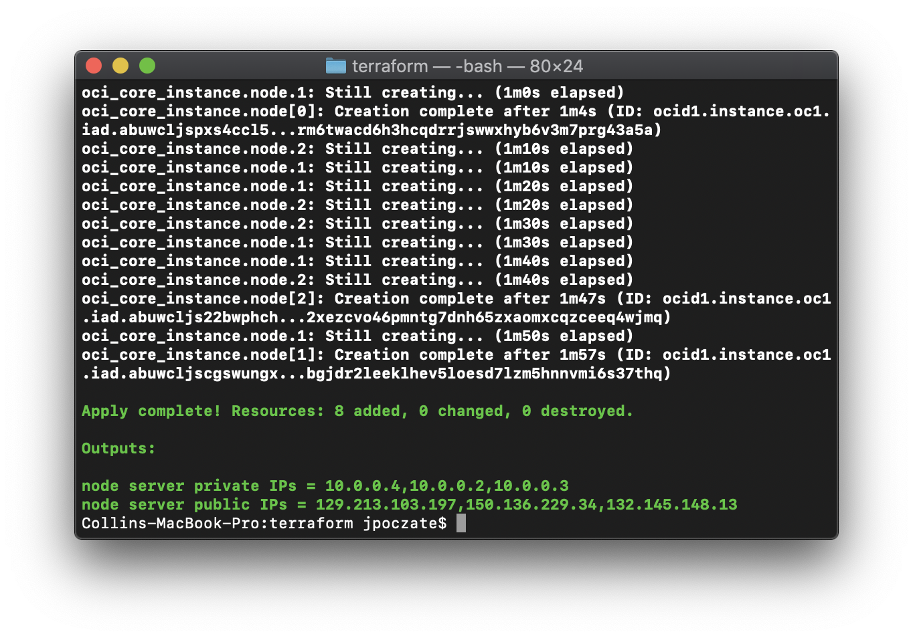
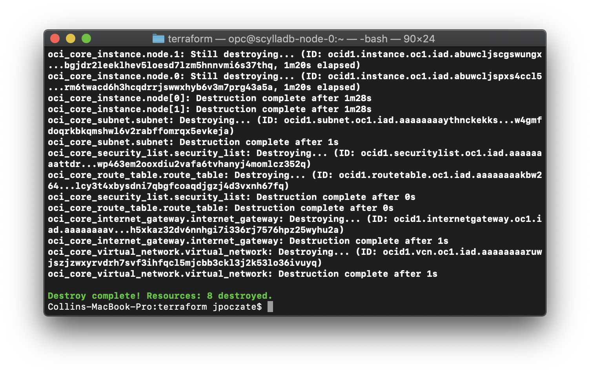

# oci-scylladb
This is a Terraform module that deploys [ScyllaDB](https://www.scylladb.com/) on [Oracle Cloud Infrastructure (OCI)](https://cloud.oracle.com/en_US/cloud-infrastructure).  It is developed jointly by Oracle and ScyllaDB.

## Prerequisites
First off you'll need to do some pre deploy setup.  That's all detailed [here](https://github.com/oracle/oci-quickstart-prerequisites).

## Clone the Module
Now, you'll want a local copy of this repo by running:

```
git clone https://github.com/oracle-quickstart/oci-scylladb.git
cd oci-scylladb/terraform/
ls
```

That should give you this:



We now need to initialize the directory with the module in it.  This makes the module aware of the OCI provider.  You can do this by running:

```
terraform init
```

This gives the following output:



## Deploy
Now for the main attraction.  Let's make sure the plan looks good:

```
terraform plan
```

That gives:



If that's good, we can go ahead and apply the deploy:

```
terraform apply
```

You'll need to enter `yes` when prompted.  The apply should take a few minutes to run.  Once complete, you'll see something like this:



## Access the Cluster
When the apply is complete, the infrastructure will be deployed, but cloud-init scripts will still be running.  Those will wrap up asynchronously.  So, it'll be a few more minutes before your cluster is accessible.

The output of `terraform apply` gives you the IPs of all nodes. If you ssh into one of the nodes, you can run `nodetool status` to see the state of all cluster nodes or `cqlsh` to execute CQL commands. Authentication and authorization are enabled on the cluster.

The password of the default user `cassandra` is set to the instance ocid of `node[0]` or hostname `scylladb-node-0`, which has the first IP in the list of IPs in the terraform output. This value is retrievable from the terraform logs, console, or the metadata server on that instance. For example you can ssh into `scylladb-node-0` and run the command `cqlsh -u cassandra -p $(curl -sSL http://169.254.169.254/opc/v1/instance/ | jq -r .id)` as shown below.  


You can change this password or create a new superuser and delete the `cassandra` user by following these [instructions](https://docs.scylladb.com/operating-scylla/security/authorization/).

## Destroy the Deployment
When you no longer need the deployment, you can run this command to destroy it:

```
terraform destroy
```

You'll need to enter `yes` when prompted.  Once complete, you'll see something like this:


